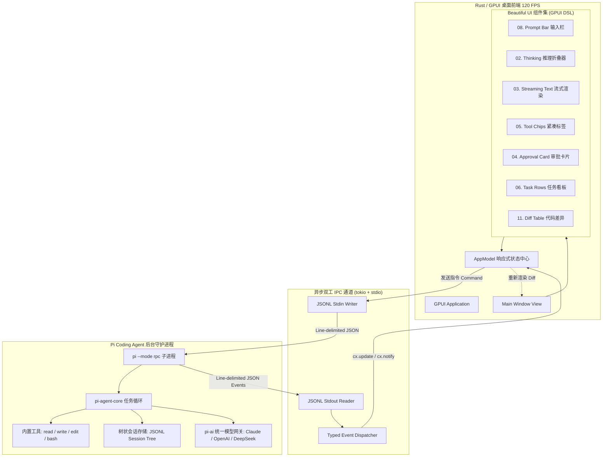

# 桌面端 AI Coding Agent MVP 架构与实现方案规范 (GPUI + Pi + Beautiful UI)

> **目标**：基于 **GPUI (Rust)** 作为原生高性能 GPU 加速桌面渲染引擎，以 **`@earendil-works/pi-coding-agent` (RPC 模式)** 作为底层 Agent 运行时与工具调用核心，融合 **Beautiful UI** 的 AI-Native 交互设计规范，构建一个毫秒级启动、内存占用低（<30MB）、支持流式打字与树状会话管理的工业级桌面 Coding Agent。

---

## 1. 总体系统架构



---

## 2. 目录结构设计 (Rust Cargo Workspace)

```text
desktop-agent-mvp/
├── Cargo.toml                  # Workspace 根配置
├── README.md
├── assets/                     # 图标与字体资源
│   └── fonts/
│       ├── Inter-Regular.ttf
│       └── JetBrainsMono-Regular.ttf
├── crates/
│   ├── app/                    # GPUI 桌面端主程序
│   │   ├── Cargo.toml
│   │   └── src/
│   │       ├── main.rs         # 应用入口与窗口初始化
│   │       ├── state.rs        # 响应式全局 Model 与 Entity 状态
│   │       ├── theme.rs        # Beautiful UI 色彩与排版常量
│   │       ├── views/          # 主视图容器
│   │       │   ├── mod.rs
│   │       │   ├── chat_panel.rs
│   │       │   ├── sidebar.rs
│   │       │   └── status_bar.rs
│   │       └── components/     # Beautiful UI 规范组件
│   │           ├── mod.rs
│   │           ├── prompt_bar.rs      # 08. Prompt Bar
│   │           ├── thinking_view.rs   # 02. Thinking
│   │           ├── streaming_text.rs  # 03. Streaming Text
│   │           ├── tool_chips.rs      # 05. Tool Chips
│   │           ├── approval_card.rs   # 04. Approval Card
│   │           ├── task_rows.rs       # 06. Task Rows
│   │           └── diff_table.rs      # 11. Diff Table
│   │
│   └── pi-client/              # Pi RPC 强类型桥接驱动
│       ├── Cargo.toml
│       └── src/
│           ├── lib.rs          # Client 启动、生命周期与句柄
│           ├── commands.rs     # 发送给 Pi 的 Command 强类型定义
│           ├── events.rs       # Pi 广播的 Event 强类型反序列化
│           └── transport.rs    # 基于 tokio stdin/stdout 的严格 JSONL 传输层
└── package.json                # 依赖管理，用于锁死 @earendil-works/pi-coding-agent 版本
```

---

## 3. IPC 协议与类型契约

### 3.1 传输层规则
* **进程拉起**：`pi --mode rpc --provider anthropic --model claude-sonnet-4-20250514`。
* **分帧规则**：严格使用 `\n`（LF）作为单条 JSON 的结束符，忽略末尾的可选 `\r`。禁止使用会将 `U+2028`/`U+2029` 误认为换行的解析器。

### 3.2 核心指令（Rust -> Pi Stdin）

```rust
// crates/pi-client/src/commands.rs
use serde::{Deserialize, Serialize};

#[derive(Debug, Serialize)]
#[serde(tag = "type", rename_all = "snake_case")]
pub enum PiCommand {
    /// 发送用户 Prompt
    Prompt {
        #[serde(skip_serializing_if = "Option::is_none")]
        id: Option<String>,
        message: String,
        #[serde(skip_serializing_if = "Option::is_none")]
        streaming_behavior: Option<StreamingBehavior>, // "steer" | "followUp"
    },
    /// 中断当前生成或执行
    Abort,
    /// 插入转向微调指令 (执行完当前工具后立即介入)
    Steer { message: String },
    /// 插入后续执行指令 (全部完成后执行)
    FollowUp { message: String },
    /// 切换模型
    SetModel { provider: String, model_id: String },
    /// 调节推理深度 (off, minimal, low, medium, high, max)
    SetThinkingLevel { level: String },
    /// 获取树状会话历史
    GetTree,
    /// 开启新会话
    NewSession {
        #[serde(skip_serializing_if = "Option::is_none")]
        parent_session: Option<String>,
    },
}

#[derive(Debug, Serialize)]
#[serde(rename_all = "camelCase")]
pub enum StreamingBehavior {
    Steer,
    FollowUp,
}
```

### 3.3 核心事件（Pi Stdout -> Rust）

```rust
// crates/pi-client/src/events.rs
use serde::{Deserialize, Serialize};

#[derive(Debug, Clone, Deserialize)]
#[serde(tag = "type", rename_all = "snake_case")]
pub enum PiEvent {
    AgentStart,
    AgentSettled,
    TurnStart,
    TurnEnd,
    MessageStart {
        message: AgentMessageInfo,
    },
    MessageUpdate {
        delta: MessageDelta,
    },
    MessageEnd {
        message: AgentMessageInfo,
    },
    ToolExecutionStart {
        tool_name: String,
        tool_call_id: String,
        args: serde_json::Value,
    },
    ToolExecutionUpdate {
        tool_call_id: String,
        chunk: String,
    },
    ToolExecutionEnd {
        tool_call_id: String,
        success: bool,
        output: String,
    },
    CompactionStart,
    CompactionEnd,
}

#[derive(Debug, Clone, Deserialize)]
#[serde(tag = "type", rename_all = "snake_case")]
pub enum MessageDelta {
    TextDelta { text: String },
    ThinkingDelta { thinking: String },
}

#[derive(Debug, Clone, Deserialize)]
pub struct AgentMessageInfo {
    pub id: String,
    pub role: String,
}
```

---

## 4. Beautiful UI 核心组件 GPUI 实现规范

GPUI 采用类似 Tailwind 的声明式链式 DSL。以下是针对 Beautiful UI 规范的典型实现模式：

### 4.1 `ThinkingView`（02. 思考状态与推理链）

* **视觉规范**：可折叠面板、微小徽章（Steps / Reasoning / Search / Coding）、计时器、幽灵背景与平滑高度过渡。

```rust
// crates/app/src/components/thinking_view.rs
use gpui::*;

pub struct ThinkingView {
    pub is_expanded: bool,
    pub thinking_buffer: String,
    pub elapsed_seconds: f32,
}

impl ThinkingView {
    pub fn new() -> Self {
        Self {
            is_expanded: true,
            thinking_buffer: String::new(),
            elapsed_seconds: 0.0,
        }
    }

    pub fn toggle_expand(&mut self, _event: &ClickEvent, _window: &mut Window, cx: &mut Context<Self>) {
        self.is_expanded = !self.is_expanded;
        cx.notify();
    }
}

impl Render for ThinkingView {
    fn render(&mut self, _window: &mut Window, cx: &mut Context<Self>) -> impl IntoElement {
        let is_expanded = self.is_expanded;
        
        div()
            .flex()
            .flex_col()
            .w_full()
            .rounded_lg()
            .border_1()
            .border_color(rgb(0x27272a)) // zinc-800
            .bg(rgb(0x18181b))           // zinc-900
            .p_3()
            .gap_2()
            .child(
                // 顶部状态栏：折叠按钮 + 状态 + 耗时
                div()
                    .id("thinking_header")
                    .cursor_pointer()
                    .flex()
                    .items_center()
                    .justify_between()
                    .on_click(cx.listener(Self::toggle_expand))
                    .child(
                        div()
                            .flex()
                            .items_center()
                            .gap_2()
                            .child(
                                div()
                                    .size_2()
                                    .rounded_full()
                                    .bg(rgb(0xa855f7)) // purple-500 indicator
                            )
                            .child(
                                div()
                                    .text_sm()
                                    .font_weight(FontWeight::SEMIBOLD)
                                    .text_color(rgb(0xe4e4e7))
                                    .child("Thinking Process")
                            )
                    )
                    .child(
                        div()
                            .text_xs()
                            .text_color(rgb(0x71717a))
                            .child(format!("{:.1}s", self.elapsed_seconds))
                    )
            )
            .when(is_expanded, |this| {
                // 展开内容区
                this.child(
                    div()
                        .pt_2()
                        .border_t_1()
                        .border_color(rgb(0x27272a))
                        .text_xs()
                        .text_color(rgb(0xa1a1aa))
                        .font_family("JetBrains Mono")
                        .child(self.thinking_buffer.clone())
                )
            })
    }
}
```

---

### 4.2 `ToolChips`（05. 工具调用状态胶囊）

* **视觉规范**：紧凑展示 `read` / `write` / `edit` / `bash` 状态，执行中带脉冲动效，成功为绿色微标，支持点击展开详情输出。

```rust
// crates/app/src/components/tool_chips.rs
use gpui::*;

#[derive(Clone, Debug)]
pub enum ToolStatus {
    Running,
    Success,
    Failed,
}

pub struct ToolChip {
    pub id: String,
    pub name: String,
    pub status: ToolStatus,
    pub summary: String,
}

impl Render for ToolChip {
    fn render(&mut self, _window: &mut Window, _cx: &mut Context<Self>) -> impl IntoElement {
        let (badge_bg, badge_text) = match self.status {
            ToolStatus::Running => (rgb(0x1e3a8a), rgb(0x60a5fa)), // blue
            ToolStatus::Success => (rgb(0x064e3b), rgb(0x34d399)), // emerald
            ToolStatus::Failed => (rgb(0x7f1d1d), rgb(0xf87171)),  // red
        };

        div()
            .flex()
            .items_center()
            .gap_2()
            .px_2p5()
            .py_1()
            .rounded_full()
            .bg(rgb(0x18181b))
            .border_1()
            .border_color(rgb(0x27272a))
            .child(
                div()
                    .px_1p5()
                    .py_0p5()
                    .rounded_sm()
                    .bg(badge_bg)
                    .text_xs()
                    .font_weight(FontWeight::BOLD)
                    .text_color(badge_text)
                    .child(self.name.clone())
            )
            .child(
                div()
                    .text_xs()
                    .text_color(rgb(0xd4d4d8))
                    .child(self.summary.clone())
            )
    }
}
```

---

### 4.3 `ApprovalCard`（04. 人机协同危险操作确认卡）

* **视觉规范**：阻断式高亮卡片，突出提示执行命令或破坏性操作，包含 Approve / Reject 快捷键。

```rust
// crates/app/src/components/approval_card.rs
use gpui::*;

pub struct ApprovalCard {
    pub tool_name: String,
    pub action_description: String,
}

impl ApprovalCard {
    fn approve(&mut self, _event: &ClickEvent, _window: &mut Window, cx: &mut Context<Self>) {
        // 向 Pi 发送允许执行确认 (或发送 steer 信号)
        cx.notify();
    }

    fn reject(&mut self, _event: &ClickEvent, _window: &mut Window, cx: &mut Context<Self>) {
        // 向 Pi 发送拒绝执行信号
        cx.notify();
    }
}

impl Render for ApprovalCard {
    fn render(&mut self, _window: &mut Window, cx: &mut Context<Self>) -> impl IntoElement {
        div()
            .flex()
            .flex_col()
            .w_full()
            .p_4()
            .rounded_lg()
            .border_1()
            .border_color(rgb(0xb45309)) // amber-700
            .bg(rgb(0x451a03))           // amber-950/40
            .gap_3()
            .child(
                div()
                    .text_sm()
                    .font_weight(FontWeight::BOLD)
                    .text_color(rgb(0xfde68a)) // amber-200
                    .child(format!("Agent requests permission to run: {}", self.tool_name))
            )
            .child(
                div()
                    .p_2()
                    .rounded_md()
                    .bg(rgb(0x18181b))
                    .font_family("JetBrains Mono")
                    .text_xs()
                    .text_color(rgb(0xf4f4f5))
                    .child(self.action_description.clone())
            )
            .child(
                div()
                    .flex()
                    .justify_end()
                    .gap_2()
                    .child(
                        div()
                            .id("btn_reject")
                            .cursor_pointer()
                            .px_3()
                            .py_1()
                            .rounded_md()
                            .bg(rgb(0x27272a))
                            .hover(|s| s.bg(rgb(0x3f3f46)))
                            .text_xs()
                            .text_color(rgb(0xe4e4e7))
                            .child("Reject (Esc)")
                            .on_click(cx.listener(Self::reject))
                    )
                    .child(
                        div()
                            .id("btn_approve")
                            .cursor_pointer()
                            .px_3()
                            .py_1()
                            .rounded_md()
                            .bg(rgb(0x2563eb)) // blue-600
                            .hover(|s| s.bg(rgb(0x1d4ed8)))
                            .text_xs()
                            .font_weight(FontWeight::SEMIBOLD)
                            .text_color(rgb(0xffffff))
                            .child("Approve (↵)")
                            .on_click(cx.listener(Self::approve))
                    )
            )
    }
}
```

---

### 4.4 `PromptBar`（08. 底部输入栏）

* **视觉规范**：支持多行展开、快捷键符号 `@`（引用文件）、`/`（扩展命令与技能）、模型指示器、Steering (`Enter`) / Follow-up (`Alt+Enter`) 模式切换。

```rust
// crates/app/src/components/prompt_bar.rs
use gpui::*;

pub struct PromptBar {
    pub input_text: String,
    pub current_model: String,
    pub is_streaming: bool,
}

impl Render for PromptBar {
    fn render(&mut self, _window: &mut Window, _cx: &mut Context<Self>) -> impl IntoElement {
        div()
            .flex()
            .flex_col()
            .w_full()
            .p_2()
            .rounded_xl()
            .border_1()
            .border_color(rgb(0x3f3f46))
            .bg(rgb(0x18181b))
            .gap_2()
            .child(
                // 模拟多行文本输入区
                div()
                    .min_h_12()
                    .text_sm()
                    .text_color(rgb(0xf4f4f5))
                    .child(if self.input_text.is_empty() {
                        "Ask Pi to code, edit, or refactor... (@ for files, / for skills)"
                    } else {
                        &self.input_text
                    })
            )
            .child(
                // 底部工具栏
                div()
                    .flex()
                    .items_center()
                    .justify_between()
                    .pt_1()
                    .border_t_1()
                    .border_color(rgb(0x27272a))
                    .child(
                        // 模型指示器
                        div()
                            .flex()
                            .items_center()
                            .gap_1p5()
                            .text_xs()
                            .text_color(rgb(0xa1a1aa))
                            .child("⚡")
                            .child(self.current_model.clone())
                    )
                    .child(
                        // 提交/微调按钮
                        div()
                            .flex()
                            .items_center()
                            .gap_2()
                            .child(
                                div()
                                    .text_xs()
                                    .text_color(rgb(0x71717a))
                                    .child(if self.is_streaming { "Enter to Steer" } else { "Enter to Send" })
                            )
                            .child(
                                div()
                                    .size_6()
                                    .rounded_md()
                                    .bg(rgb(0x3b82f6))
                                    .flex()
                                    .items_center()
                                    .justify_center()
                                    .text_white()
                                    .child("↑")
                            )
                    )
            )
    }
}
```

---

## 5. 状态同步与事件驱动循环 (Event Loop)

GPUI 的核心是异步调度器 `cx.spawn`。以下为主应用中的事件监听与状态分发实现：

```rust
// crates/app/src/state.rs
use gpui::*;
use pi_client::{PiClient, PiEvent, MessageDelta};

pub struct AppState {
    pub client: PiClient,
    pub current_model: String,
    pub is_streaming: bool,
    pub active_thinking: String,
    pub messages: Vec<MessageUiState>,
}

pub struct MessageUiState {
    pub role: String,
    pub content: String,
    pub tool_calls: Vec<ToolExecutionUiState>,
}

pub struct ToolExecutionUiState {
    pub tool_call_id: String,
    pub tool_name: String,
    pub summary: String,
    pub is_finished: bool,
}

impl AppState {
    pub fn init(cx: &mut AppContext) -> Model<Self> {
        let (client, mut event_rx) = PiClient::spawn("anthropic", "claude-sonnet-4-20250514").unwrap();

        let model = cx.new_model(|_cx| AppState {
            client,
            current_model: "Claude 3.7 Sonnet".into(),
            is_streaming: false,
            active_thinking: String::new(),
            messages: Vec::new(),
        });

        // 启动后台事件监听协程
        let model_handle = model.clone();
        cx.spawn(|mut cx| async move {
            while let Some(event) = event_rx.recv().await {
                let _ = cx.update_model(&model_handle, |state, cx| {
                    state.handle_pi_event(event);
                    cx.notify(); // 触发全量增量 Diff 重绘
                });
            }
        }).detach();

        model
    }

    fn handle_pi_event(&mut self, event: PiEvent) {
        match event {
            PiEvent::AgentStart => {
                self.is_streaming = true;
                self.active_thinking.clear();
            }
            PiEvent::AgentSettled => {
                self.is_streaming = false;
            }
            PiEvent::MessageUpdate { delta } => match delta {
                MessageDelta::ThinkingDelta { thinking } => {
                    self.active_thinking.push_str(&thinking);
                }
                MessageDelta::TextDelta { text } => {
                    if let Some(last_msg) = self.messages.last_mut() {
                        last_msg.content.push_str(&text);
                    }
                }
            },
            PiEvent::ToolExecutionStart { tool_name, tool_call_id, args } => {
                if let Some(last_msg) = self.messages.last_mut() {
                    last_msg.tool_calls.push(ToolExecutionUiState {
                        tool_call_id,
                        tool_name,
                        summary: format!("{}", args),
                        is_finished: false,
                    });
                }
            }
            PiEvent::ToolExecutionEnd { tool_call_id, .. } => {
                if let Some(last_msg) = self.messages.last_mut() {
                    if let Some(tool) = last_msg.tool_calls.iter_mut().find(|t| t.tool_call_id == tool_call_id) {
                        tool.is_finished = true;
                    }
                }
            }
            _ => {}
        }
    }
}
```

---

## 6. MVP 开发分期路线图 (Milestones)

### Phase 1: 脚手架与通信骨架 (Day 1 - 2)
* [ ] 初始化 Cargo Workspace 与 Rust/Node 环境。
* [ ] 封装 `pi-client` 模块：实现通过 `tokio::process::Command` 启动 `pi --mode rpc`。
* [ ] 实现基于 `\n` 的 JSONL 编解码流，完成 `prompt`、`abort`、`get_tree` 的单元测试。

### Phase 2: Beautiful UI 基础组件库搭建 (Day 3 - 5)
* [ ] 实现 Dark Mode 主题基元与调色盘 (`theme.rs`)。
* [ ] 实现 **Prompt Bar**（多行输入与按键监听）。
* [ ] 实现 **Streaming Text**（Markdown 语法高亮与打字机流式追加）。
* [ ] 实现 **Thinking View**（折叠动画与耗时计时）。

### Phase 3: 工具链与协同闭环 (Day 6 - 8)
* [ ] 监听 `ToolExecutionStart` / `ToolExecutionEnd`，集成 **Tool Chips**。
* [ ] 实现 `ApprovalCard`，支持 Agent 执行高危 bash 命令时的拦截审批。
* [ ] 实现代码变更差异比对视图 **Diff Table**。

### Phase 4: 树状历史会话与系统打磨 (Day 9 - 10)
* [ ] 接入 Pi 的 `/tree` 分支数据结构，在侧边栏渲染分支历史树。
* [ ] 优化 GPU 渲染帧率与内存占用（验证冷启动 <50ms，空闲内存 <30MB）。

---

## 7. 验证与验收标准

1. **冷启动与资源占用**：
   * 启动到可交互时间 $\le 50\text{ms}$。
   * 基础空闲内存占用 $\le 30\text{MB}$（对比 Electron > 200MB）。
2. **流式吞吐与无撕裂渲染**：
   * 在 LLM 以 100+ tokens/s 高速吐字时，GPUI 保持 120 FPS 丝滑打字动效，CPU 占用低于 5%。
3. **Agent 全功能闭环**：
   * 成功执行 `read`、`write`、`edit`（Diff 渲染）、`bash`（Terminal 输出）完整工具链路。
   * 支持通过 `Enter` 进行实时转向微调（Steer），通过 `Alt+Enter` 排队后续任务（Follow-up）。
