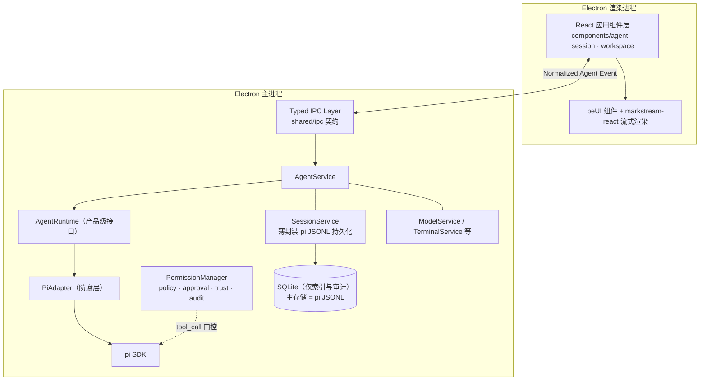
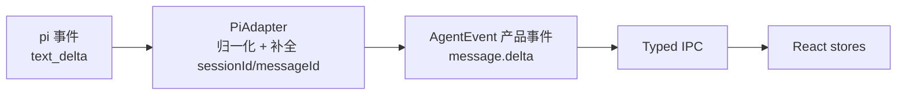
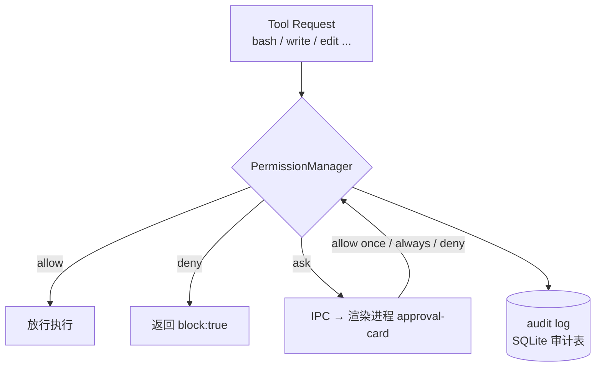

# 桌面 Agent 技术选型文档

> 状态：v0.3（架构冻结，进入实施）
> 日期：2026-02
> 目标：基于 pi SDK + Electron 构建本地 coding agent 桌面客户端

---

## 1. 总体架构



职责划分：

- **渲染进程**：纯展示层。只依赖产品级 `AgentEvent` 和 Typed IPC 契约，**不感知 pi 的存在**。
- **AgentRuntime / PiAdapter**：防腐层。把 pi 事件归一化为产品事件（`text_delta` → `message.delta`），未来替换 RPC 模式或自研 Runtime 时 UI 层零改动。
- **PermissionManager**：安全边界。所有工具调用经它门控（allow / deny / ask），approval-card 只是它的 UI。
- **SessionService**：薄封装 pi 的 JSONL 会话持久化，不重复造存储。

## 2. 分层选型

| 层 | 选型 | 理由 |
|---|---|---|
| Agent 内核 | `@earendil-works/pi-coding-agent` SDK（主进程直嵌） | 官方支持桌面嵌入场景；事件流完整；会话树 / fork / compaction / 多 provider 开箱即用 |
| Agent 内核备选 | RPC 子进程模式（`pi --mode rpc`） | 经 PiAdapter 切换，UI 零改动；协议要求严格按 `\n` 分帧 |
| 桌面壳 | Electron | 已定 |
| UI 框架 | React 18+ / Tailwind v4 | beUI 与 markstream-react 的共同 peer 要求 |
| 组件库 | beUI（shadcn registry 拉取源码）+ 自有应用组件层 | beUI 是实现手段不是架构边界；产品组件（`components/agent/AgentMessage` 等）包装 beUI，保证可替换 |
| Markdown 流渲染 | markstream-react ≥2.0 | 内置 smooth streaming、`htmlPolicy="safe"` 安全默认、Mermaid/KaTeX 可选 peer |
| 图标 | lucide-react（随 beUI 组件引入） | beUI 源码全部使用 lucide，保留即全项目单一图标族；Phosphor 为可选后续迁移项（见第 6 节） |
| 动画 | Motion (`motion/react`) | beUI 已依赖，不额外引入 GSAP |
| 本地存储 | pi JSONL（主存储）+ SQLite（仅索引/审计，按需） | 见第 5 节 Session 持久化 |

### 2.1 为什么是 pi SDK 而不是 RPC

- 同进程类型安全，直接访问 session 状态（`session.messages`、`session.agent.state`）
- 官方文档明确将 "Build a custom UI (web, desktop, mobile)" 列为 SDK 用例
- RPC 仅在需要进程隔离时通过 PiAdapter 作为后备方案

### 2.2 为什么是 beUI 而不是 Beautiful UI

- beUI 是真正的组件库：shadcn registry 安装、完整 TS 类型、`useReducedMotion` 支持
- `prompt-input` 的 props（`models`/`onModelChange`/`loading`/`onStop`/`onSubmit`）几乎一一对应 pi SDK 能力
- 自带 `message-scroller`（跟随流式 live edge、用户上滚释放控制），自研成本高
- Beautiful UI（beautifului.dev）降级为长尾模式的视觉参考（表格类、Flowchart、Insight Cards 等 beUI 未覆盖的模式）

## 3. 核心数据流映射

Pi 事件经 **PiAdapter 归一化**后进入 IPC，渲染进程只消费产品事件：



| pi SDK 事件/API | PiAdapter 归一化 | 产品事件 / Channel | UI 承接 |
|---|---|---|---|
| `text_delta` | 补 sessionId/messageId | `message.delta` | markstream-react：流式中 `smoothStreaming="auto"` + `fade={false}`；历史回放切 `smoothStreaming={false}` + `fade={true}` |
| `thinking_delta` | 同上 | `thinking.delta` | beUI `agent-activity` 推理链折叠面板 |
| `tool_execution_start/end` | 统一 toolCallId 载荷 | `tool.started` / `tool.finished` | beUI `tool-result` chips |
| edit 工具 `details.patch` | 并入 tool.finished 载荷 | `tool.finished{ patch }` | beUI `file-diff` 渲染文件变更 |
| 扩展拦截 `tool_call` | 转 approval 请求 | `approval.requested` / `approval.resolved` | beUI `approval-card` / `tool-approval` |
| `isStreaming` / `abort()` | — | `agent.state` / `agent.abort` 命令 | beUI `prompt-input` 的 `loading` / `onStop` |
| `ModelRuntime.getAvailable()` | ModelInfo[] | `models.list` | beUI `prompt-input` 的 `models` / `onModelChange` |
| `SessionManager.list/open` | SessionMeta[] | `session.list` / `session.open` | 会话侧边栏 |
| `agent_start` / `agent_end` | 补结束原因（completed / aborted / failed） | `agent.started` / `agent.completed` / `agent.aborted` | 驱动 UI loading / 完成态 / 停止态 |
| `state.errorMessage` + `auto_retry_*` | 细分错误类型（llm / tool / permission / network / runtime） | `agent.failed{ kind }` | 错误提示、重试按钮；重试中状态接 `auto_retry_*` 事件 |
| `compaction_start/end` | — | `context.compaction` | 上下文压缩进度提示（不自建 ContextManager，仅展示） |

### 3.1 Typed IPC 契约

```text
packages/shared/src/ipc/
├── events.ts      # AgentEvent 联合类型（单一事实来源）
├── commands.ts    # 渲染进程 → 主进程命令签名
└── schemas.ts     # zod / typebox schema 校验（可选）
```

原则：

- Main 与 Renderer 只 import `shared` 包的类型，禁止在 UI 层出现 pi 类型
- Channel 字符串由常量枚举生成，不手写字符串

### 3.2 主进程骨架（示意）

```typescript
// packages/agent-core/src/pi-adapter.ts
import { createAgentSession, ModelRuntime, SessionManager } from "@earendil-works/pi-coding-agent";

export class PiAdapter implements AgentRuntime {
  private session!: AgentSession;
  private unsubscribe: (() => void) | undefined;

  async start(cwd: string) {
    // 正式产品用持久化会话，不用 inMemory
    const modelRuntime = await ModelRuntime.create();
    const { session } = await createAgentSession({
      sessionManager: SessionManager.create(cwd),
      modelRuntime,
    });
    this.attach(session);
  }

  /** 会话替换（switch/new/fork）后必须重绑：事件订阅挂在具体 AgentSession 上 */
  private attach(session: AgentSession) {
    this.unsubscribe?.();
    this.session = session;
    this.unsubscribe = session.subscribe((event) => {
      // pi 事件 → 产品事件归一化
      if (event.type === "message_update") {
        const e = event.assistantMessageEvent;
        if (e.type === "text_delta") this.emit({ type: "message.delta", delta: e.delta });
        if (e.type === "thinking_delta") this.emit({ type: "thinking.delta", delta: e.delta });
      }
      if (event.type === "tool_execution_start") {
        this.emit({ type: "tool.started", toolName: event.toolName, toolCallId: event.toolCallId });
      }
      // ...
    });
  }

  prompt(input: PromptInput) { return this.session.prompt(input.text); }
  abort() { return this.session.abort(); }

  /** 由 SessionService 在 switchSession/newSession/fork 后调用 */
  rebind(runtime: AgentSessionRuntime) {
    this.attach(runtime.session);
    // 扩展也挂在具体 session 上：PermissionManager 等扩展必须重绑，否则门控静默失效
    runtime.session.bindExtensions();
  }
}
```

**事件重绑定纪律（真实缺口，勿省略）**：pi 的订阅和扩展都挂在具体 `AgentSession` 实例上，`switchSession()/newSession()/fork()` 会替换实例。PiAdapter 必须封装 attach/rebind（subscribe 返回 unsubscribe，替换后先退订再重挂），扩展侧调用 `runtime.session.bindExtensions()`。已纳入 Spike 验收清单。

### 3.3 渲染进程骨架（示意）

```tsx
function AgentMessage({ isStreaming }: { isStreaming: boolean }) {
  const [content, setContent] = useState("");

  useEffect(() => {
    // 只消费产品事件，不感知 pi
    const off = window.agent.on("message.delta", (e) => setContent((c) => c + e.delta));
    return off;
  }, []);

  return (
    <Markstream
      content={content}
      smoothStreaming={isStreaming ? "auto" : false}
      fade={!isStreaming}
      typewriter={isStreaming}
    />
  );
}
```

注意事项：

- 单条 message 做成独立 memo 组件，delta 只触发自身重渲染，消息列表其余部分不动
- `await session.prompt()` 会等整轮结束，流式 UI 完全靠 subscribe 事件驱动
- 工具调用从文本流中拆出单独渲染，markdown 只渲染纯文本部分

## 4. 权限与项目信任（一级模块）

> Approval Card 是 UI；PermissionManager 才是安全边界。

pi 无内置权限弹窗，但官方提供 `tool_call` 拦截点（见 `examples/extensions/permission-gate.ts`）：扩展中 `pi.on("tool_call")` 返回 `{ block: true }` 即可阻止执行。我们的实现方式：



- **PermissionManager** 以 pi extension 形态接入（拦截 `tool_call`），决策结果经 IPC 异步等待渲染进程的 approval-card 回答
- 决策粒度带 scope：本次允许 / 当前会话允许 / 当前工作区允许 / 永久允许（记录到 tool + command + scope 粒度，如 "allow: bash `git status` @ workspace"，不做粗粒度的"永久允许整个工具"）/ 拒绝。v0.1 只存 scope 字段，不建 rule engine
- 高危模式（`rm -rf`、`sudo`、`git reset --hard`、`npm publish` 等）默认进 ask 名单
- **Project Trust**：首次打开项目目录弹出信任确认（Untrusted / Trusted / Restricted），落盘到信任存储，并与权限名单联动

### 4.1 PendingApproval 状态机

`ask` 路径是跨进程异步流程（pi tool_call → 主进程挂起 → IPC → 渲染进程 → 用户决策 → IPC 回写），必须显式管理未决状态：

```typescript
type PendingApproval = {
  requestId: string;
  sessionId: string;
  toolCallId: string;
  toolName: string;
  input: unknown;
  createdAt: number;
  status: "pending" | "resolved" | "cancelled" | "expired";
};
```

主进程维护 ApprovalRegistry（PendingApprovalStore），扩展的 `tool_call` handler 返回一个 Promise，由 registry 在收到渲染进程响应时 resolve。

**必须处理的生命周期**（否则 Promise 泄漏 / UI 悬挂）：

| 场景 | 处理 |
|---|---|
| 多个工具同时等待审批 | requestId 一一对应，各自独立 resolve |
| 用户 abort（Escape / 停止按钮） | 取消该会话所有 pending → status=cancelled，pi 侧 handler 以 block 返回 |
| 切换/新建会话 | 取消旧会话 pending |
| 窗口关闭 / renderer 崩溃 | 主进程超时兜底，全部置 cancelled |
| 审批超时 | 可配置 TTL，过期置 expired 并拒绝执行 |
| 重复响应（同 requestId 二次回写） | 幂等：仅首次生效 |

安全相关逻辑（本节全部行为）作为独立测试重点，不等 UI 完成后补测：allow / deny / ask / abort / timeout / window close / session switch / renderer crash / duplicate response。

## 5. Session 持久化

**主存储直接使用 pi 的 JSONL 会话文件**，不自建第二份存储：

- pi 会话原生持久化（树结构，支持 branch/fork/resume/import）
- `SessionManager.create(cwd)` / `continueRecent(cwd)` / `list()` / `listAll()` / `open()` 全部现成
- `runtime.newSession() / switchSession() / fork()` 负责会话替换

```text
SessionService（薄封装，非重写；原则：pi 有的用 pi API，没有的才加最薄适配）
├── list()          → SessionManager.listAll + 元数据整理
├── open(id)        → runtime.switchSession
├── fork(entryId)   → runtime.fork
├── rename(name)    → pi.setSessionName()（原生 API，勿直接改 JSONL）
├── delete(id)      → 移除 .jsonl 文件；优先 trash CLI（与 pi /resume 行为一致，可恢复）
└── search()        → P2 产品功能，届时再定 SQLite 全文索引 schema
```

原则：避免 SessionService 膨胀成第二套 Session Runtime；AgentRuntime 接口同理——只暴露产品真实需要的能力，不做 pi API 全量 wrapper。

**SQLite 定位（按需引入，不做主存储）**：仅存索引与派生数据——跨会话全文搜索、权限审计日志、应用设置。避免与 JSONL 形成双数据源同步问题。

## 6. 安装清单

### 6.1 主进程 / agent-core

```bash
npm i @earendil-works/pi-coding-agent
```

打包时确保 pi 位于 main 的 dependencies（electron-builder 的 `files` 配置），不要被 tree-shake。

### 6.2 渲染进程（最小 peer 集）

```bash
npm i react react-dom tailwindcss motion
npm i markstream-react stream-diffs mermaid katex

# beUI 组件（shadcn registry）
npx shadcn add https://beui.dev/r/prompt-input \
                https://beui.dev/r/agent-activity \
                https://beui.dev/r/tool-result \
                https://beui.dev/r/file-diff \
                https://beui.dev/r/approval-card \
                https://beui.dev/r/message-scroller
```

跳过的可选 peer（最小安装原则）：`@terrastruct/d2`、`@antv/infographic`。

### 6.3 CSS 引入顺序（渲染进程入口）

```tsx
import './reset.css'                          // reset 在前
import 'markstream-react/index.css'           // Tailwind 项目用 layer(components)
import 'katex/dist/katex.min.css'             // 启用公式时必须显式引入
```

Tailwind 项目中 markstream 样式写法：

```css
@import 'markstream-react/index.css' layer(components);
```

### 6.4 功能开关

| 功能 | 支持 | 说明 |
|---|---|---|
| Mermaid 图表 | ✅ 装 `mermaid >= 11` 即自动启用 | ` ```mermaid ` 围栏渲染为图表 |
| KaTeX 公式 | ✅ 装 `katex >= 0.16.22` + 引入其 CSS | 行内/块级 LaTeX |
| 增强代码块 / Diff | ✅ `stream-diffs` | 不装则降级普通 `<pre><code>` |
| D2 / 信息图 | ⏸ 暂不装 | agent 输出极少出现，需要再加 |

## 7. 工程结构与关键约束

### 7.1 v0.1 目录结构（最小 monorepo）

```text
desktop-agent/
├── apps/
│   └── desktop/
│       ├── electron/
│       │   ├── main.ts            # 生命周期 / 窗口 / IPC 注册
│       │   ├── ipc/               # 按 agent/session/settings 分文件注册
│       │   └── services/
│       └── renderer/
│           ├── components/
│           │   ├── agent/         # AgentMessage / AgentThinking / AgentApproval ...
│           │   ├── session/       # 包装 beUI，隔离组件库 API
│           │   └── settings/
│           ├── stores/
│           └── hooks/
├── packages/
│   ├── shared/                    # IPC 契约 + 产品事件类型（Main/Renderer 共用）
│   └── agent-core/                # PiAdapter + AgentService + PermissionManager
├── package.json
├── pnpm-workspace.yaml
└── tsconfig.json
```

先只拆 `shared` + `agent-core` 两包，llm/tools/mcp/context 等先用目录边界，出现真实复用需求再提取为独立包。

### 7.2 关键约束

1. **安全默认不放宽**：markstream 保持 `htmlPolicy="safe"` 和 Mermaid strict mode（agent 输出不可信）；权限决策集中在 PermissionManager，UI 不承担决策逻辑。
2. **pi 只跑在主进程**：依赖 Node API（fs、child_process），不能进渲染进程。
3. **耦合纪律**：UI 不 import pi 类型；beUI 不直接出现在页面组件里（经 components/agent 包装）；SQLite 不被 React 或 pi 直接读写。
4. **Context 管理**：不自建 ContextManager，订阅 pi 内置 compaction 事件（`compaction_start/end`）做 UI 展示即可。
5. **MVP 范围**：6 个 beUI 组件起步（见安装清单）；Beautiful UI 仅作参考不引入代码。
6. **设计纪律**：
   - 单一 accent 色、统一圆角系统、暗色优先双模式（WCAG AA）
   - 反 AI 味清单执行（无装饰性状态点滥用、无 em-dash、无假精确数字、无 div 拼假截图）
   - 三态完整：loading（骨架屏）/ empty / error
7. **性能**：animate 只用 transform/opacity；`prefers-reduced-motion` 全链路尊重（beUI 内置）；LCP < 2.5s。
8. **图标策略**：MVP 阶段保留 lucide-react（随 beUI 引入），全项目单一图标族，不混用；全局 `strokeWidth` 统一为 2。若产品成型后需要品牌差异化，再做一次性 Phosphor 迁移（届时组件数量固定，用 codemod 批量改 import，Phosphor regular weight 对齐 lucide strokeWidth 2）

### 7.3 实施纪律（v0.3 评审后确定）

**首个任务：Permission Gate Spike**。真实验证 `pi tool_call → PermissionManager → IPC → Approval UI → resolve/block` 异步链路，按 §4.1 生命周期表逐场景验收（多 pending、abort、session 切换、窗口关闭）。这是方案中唯一的新发明，其余均为组装现成能力，Spike 通过 = 最大技术风险消除。

Spike 验收附加项：
- **事件重绑定**：switch/new/fork 会话后 delta/tool/权限拦截仍正常工作（见 §3.2 重绑定纪律）
- **toolCallId 断言**：SDK 层 `tool_execution_start/end` 事件的 `toolCallId` 已经类型定义确认存在（`pi-agent-core` AgentEvent），Spike 中加一行运行时断言即可
- **实现提醒**：自建 PermissionManager 扩展持有自己的 Promise registry，不复用官方 permission-gate.ts 的 `ctx.ui` helper（其 `ctx.hasUI === false` 直接 block 的分支不适用于我们）

**Session delete 已核实落定**（经 pi 官方文档确认）：
- pi 无 SDK 删除 API，官方 `/resume` 界面的删除即移除 `.jsonl` 文件，且优先用 trash CLI（可恢复）
- 我们的 delete 采用同一约定：trash CLI 优先，fallback 直接删除；删除后 `SessionManager.list()` 天然正常
- rename 走原生 `pi.setSessionName()`，不碰文件

**SQLite sidecar 纪律**：
- JSONL 始终是主存储；SQLite 仅审计/索引等派生数据，绝不进入 Agent/Session 核心执行路径
- 审计写入 fire-and-forget：内存队列 + 异步落盘，写失败仅记 warning，绝不阻塞 `tool_call` handler 返回
- 连接 lazy 初始化：首次审计写入时才建库建表，Agent 启动路径不碰 SQLite

**IPC 契约暂不引入 runtime schema**：
- v0.1 以 TypeScript 编译期类型作为 Main↔Renderer 契约，zod/typebox 保持可选
- 引入时机：出现外部不可信输入、插件体系或复杂持久化恢复需求
- 保留项（与 schema 无关的防线）：PermissionManager 对回写的 approval response 做手写防御校验（requestId 存在性 + status 合法值），权限决策入口不信任任何来路消息

## 8. 参考资源

| 资源 | 地址 |
|---|---|
| pi SDK 文档 | 本地 `~/.bun/install/global/node_modules/@earendil-works/pi-coding-agent/docs/sdk.md` |
| pi SDK 示例 | `examples/sdk/01-minimal.ts` ~ `13-session-runtime.ts`（递进式） |
| pi 权限扩展示例 | `examples/extensions/permission-gate.ts`（`tool_call` 拦截） |
| beUI agents 组件 | https://beui.dev/components/agents |
| beUI registry | `https://beui.dev/r/{slug}` / `/raw` |
| Beautiful UI 参考 | https://www.beautifului.dev/ |
| markstream-react | https://www.npmjs.com/package/markstream-react |
