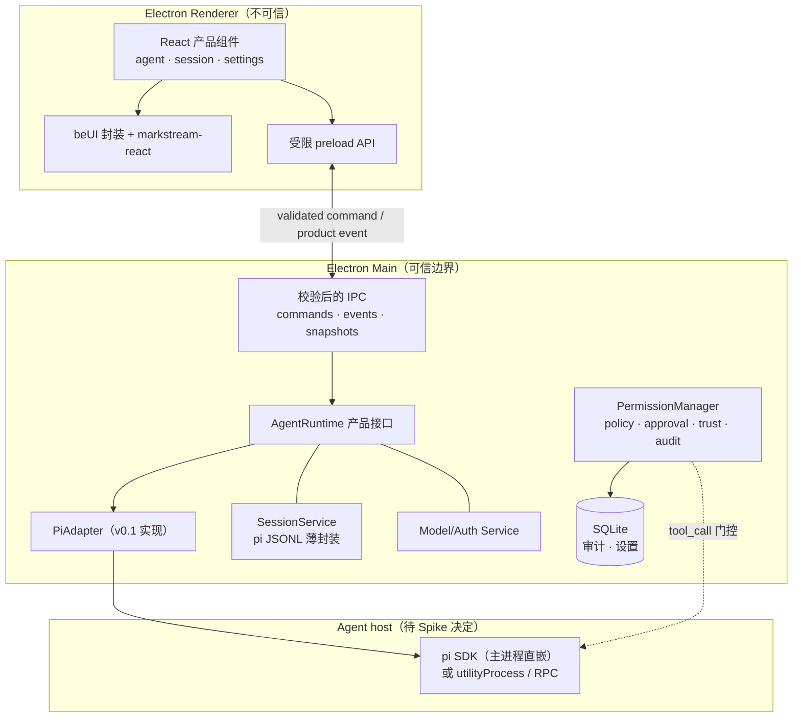
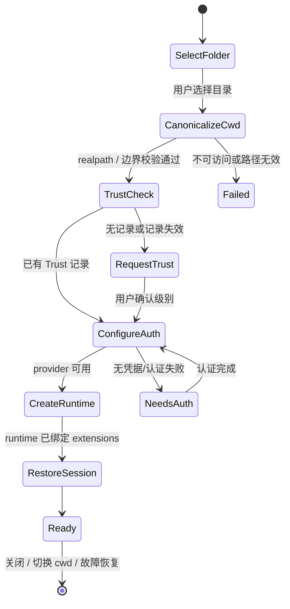

> 状态：v0.6（**架构冻结，进入实施**。Spike 验收结果与宿主模型 ADR 见 [Spike 结论与宿主模型 ADR](spike-report)）
>
> 日期：2026-08-24（v0.6：Spike 通过，冻结宿主模型与构建工具链，锁定依赖版本）
>
> 目标：基于 pi SDK 与 Electron 构建本地 coding agent 桌面客户端。

本文是架构决策和 MVP 实施规格，不是完整 UI 规范。

---

## 1. 决策状态与 MVP 边界

### 1.1 已确认的方向

- Electron 作为桌面壳；React、Tailwind、beUI 和 markstream-react 作为 Renderer 候选实现。
- UI 只依赖产品级 IPC 契约，不导入 pi 类型。
- pi JSONL 是会话主存储；SQLite 只存审计、应用设置及未来索引等派生数据。
- PermissionManager 是主进程安全边界，approval card 只是其 Renderer UI。
- `AgentRuntime` 是产品接口，`PiAdapter` 是 v0.1 唯一实现；不在 MVP 引入独立 `AgentService` 层。

### 1.2 冻结前未决项

- Pi 直嵌主进程、`utilityProcess` 或 RPC 子进程的最终宿主模型。
- 进程崩溃/卡死后的 runtime dispose、重建和会话恢复语义。
- 鉴权实现细节（隔离方案与流程已定，见第 8 节）：系统安全存储选用哪个平台 API，OAuth 走系统浏览器还是内嵌流。
- JSONL/SQLite 的版本、迁移、备份、恢复、保留期和损坏处理（含审计 schema）。
- v0.1 的构建/发布方案、精确依赖版本和平台支持。

### 1.3 v0.1 范围

| 包含 | 明确不包含 |
|---|---|
| 单工作区、会话列表/新建/打开/fork/重命名/可恢复删除 | 内置终端、文件树、Git 面板 |
| 文本/推理/工具事件、流式 Markdown、文件 diff | MCP、附件、多工作区并行 |
| provider 选择与认证、模型选择、停止、基础错误恢复 | 项目内 extensions/skills 自动加载 |
| 工具审批、项目 Trust、审计日志 | 全文搜索、永久 shell 允许规则、自动更新 |

任何新增能力必须先更新本表、产品事件契约和安全模型；不得仅在架构图中以“等”暗示已纳入 MVP。

## 2. 总体架构与进程模型



职责：

- **Renderer**：展示产品状态；不持有文件系统、Node、pi 或凭据能力。
- **preload / IPC**：只暴露白名单操作；主进程验证 sender、输入和授权。
- **AgentRuntime / PiAdapter**：归一化 pi 状态和事件，隔离 Renderer 与底层 transport。
- **PermissionManager**：拦截工具调用、等待审批、保存最小审计记录。
- **SessionService**：调用 pi 的会话 API；不重写 session runtime。

### 2.1 宿主模型 ADR（已决定，详见 spike-report.md §3）

> **决定：v0.1 采用 Pi 直嵌 Main。** Spike 已验证单进程内的全部取消语义、dispose + 同 cwd 重建可重入、事件管道有序有界；跨进程方案仅在引入多窗口/多工作区并行或同步阻塞型工具时重新评估。

| 方案 | 优点 | 代价 / 必须验证 |
|---|---|---|
| Pi 直嵌 Main | 类型直接、实现最短 | 同步阻塞、OOM、原生崩溃与 Main 同一故障域；必须能捕获普通异常、dispose 并重建 runtime |
| `utilityProcess` / RPC | 将 Agent 的阻塞/崩溃与窗口隔离 | 生命周期、日志、认证、cwd、会话恢复和 pending approval 都须跨进程重做；不等同于“零改动切换” |

PiAdapter 的目标仅是保持 **Renderer 产品契约** 稳定。若切换 transport，主进程生命周期、取消和权限 Promise 仍须按新进程模型重新设计。

冻结条件：完成第 10 节的 Spike 后，按卡死恢复、事件可靠性、打包复杂度和权限取消语义选择其一，并写入单独 ADR。

## 3. Electron 安全默认（设计已冻结，实施待验证）

所有 BrowserWindow 必须采用以下默认值：

```ts
new BrowserWindow({
  webPreferences: {
    preload: preloadPath,
    contextIsolation: true,
    sandbox: true,
    nodeIntegration: false,
  },
});
```

此外：

1. preload 通过 `contextBridge` 暴露每个具体命令和事件订阅包装器；不得暴露 `ipcRenderer`、事件对象或泛型 `invoke/send`。
2. 每个 `ipcMain.handle/on` 都校验 sender frame、窗口身份、输入 schema、当前 cwd/会话所有权及 Trust/权限；类型声明不是运行时安全校验。
3. 配置严格 CSP；拒绝非预期导航、`window.open` 与 webview；外链只经受控 allowlist 交给系统浏览器。
4. Renderer 不得读取环境变量、`~/.pi/agent/auth.json`、钥匙串、文件系统或原始 API key。主进程不得通过 IPC 返回凭据。
5. API key/OAuth credential 仅由 Main 管理，保存在系统安全存储；审计、错误报告和日志一律脱敏。

Electron 的官方安全文档要求隔离 context、关闭 Node integration、启用 sandbox，并在 IPC handler 校验 sender；这些默认值已经是架构决策。Spike 只验证它们在开发和打包产物中均实际生效、Renderer 仍能通过受限 preload 完成产品流程。

## 4. 工作区、Trust 与 runtime 生命周期

### 4.1 打开工作区状态机



`cwd` 必须在主进程 canonicalize（`realpath`）后才可被使用。工作区路径边界一律基于 canonical path 判定，处理 symlink、挂载盘和不存在路径；切换 cwd 时取消旧会话的审批、dispose runtime，再开始新流程。

### 4.2 v0.1 Trust matrix

信任记录保存于应用设置（key = canonical workspace path），路径不可解析、工作区被移除或用户手动撤销时失效。

> 实现落点：v0.1 将记录存于应用私有 `trust.json`（userData 目录，非 CLI 路径），`TrustStore` 原子写入、损坏时 fail-closed 重置；`workspace.open` 在 canonicalize 后按该路径恢复已授权级别，无记录则为 untrusted，旧目录的信任不会泄漏到新目录。验证见 `pnpm probe:trust-persist`。

| 能力 | Untrusted | Restricted | Trusted |
|---|---|---|---|
| 创建 Agent runtime | 否 | 是 | 是 |
| 内置只读工具（限工作区） | 否 | 是 | 是 |
| 写文件 / edit | 否 | 否 | 需 PermissionManager ask |
| bash / 网络工具 | 否 | 否 | 需 PermissionManager ask |
| 工作区外路径 / 凭据 | 否 | 否 | 否（v0.1） |
| 项目 extensions / skills / 自定义配置 | 否 | 否 | 否（v0.1） |
| MCP | 否 | 否 | 否（v0.1） |

Untrusted 是“尚未授权”的打开结果：应用只显示目录信息与 Trust 选择，不创建 Agent runtime；用户取消即返回文件夹选择，不将它当成可工作的 Agent 模式。

Restricted 创建 runtime 时固定传入内置只读工具 allowlist：`["read", "grep", "find", "ls"]`。PermissionManager 对每次工具输入中的路径先 `realpath`，再校验其位于 canonical cwd 内；路径不存在、无法解析、符号链接逃逸或指向工作区外时一律拒绝。Trusted 仍执行同一边界检查，额外能力只可经审批放行。

### 4.3 资源发现与 Pi 内建 Trust

Trusted 不等于允许执行项目资源。v0.1 不做自定义 loader，而是接受内部仍为 `DefaultResourceLoader` 的实现，隔离靠两个手段：`agentDir` 重定向到应用私有目录 + 各 override 置空压掉默认发现。禁止扫描的路径：`.pi/extensions`、`.pi/skills`、`.agents/skills/`（cwd 及祖先目录）、`AGENTS.md`、`CLAUDE.md`、`~/.pi/agent/extensions`、`~/.pi/agent/skills`、`~/.pi/agent/AGENTS.md`、**`~/.agents/skills/`**。唯一允许的扩展为应用内联 `extensionFactories` 注册的 PermissionManager；`extensionFactories` 只用于注册允许项，不能被视为关闭默认发现的开关。

Pi 内建 Project Trust（`~/.pi/agent/trust.json`）在 v0.1 完全旁路：产品 Trust 是唯一决策来源，应用的内联 `project_trust` handler 始终返回 `{ trusted: "no", remember: false }`。Pi CLI 与桌面应用的 Trust 决策互不读取、互不覆盖。后续若需要加载项目资源，必须单独设计两套 Trust 的迁移/复用策略并经过安全评审。

### 4.4 配置与存储路径隔离（v0.1 写死）

资源发现与 auth.json 之外，以下 CLI 默认路径同样全部旁路，不得读取或写入：

| pi 能力 | CLI 默认路径 | 桌面应用替代 |
|---|---|---|
| 全局/项目 settings | `~/.pi/agent/settings.json`、`.pi/settings.json` | `SettingsManager.inMemory(...)` 或指向应用私有 agentDir 的 `create` |
| 自定义模型目录 | `~/.pi/agent/models.json` | `ModelRuntime.create({ modelsPath })` 指向应用数据目录 |
| 凭据 | `~/.pi/agent/auth.json` | 应用 `CredentialStore`（见第 8 节） |
| 会话存储 | `~/.pi/agent/sessions/` | 显式构造 `SessionManager.create(cwd, sessionDir)` 并传入 runtime factory（如 `app.getPath('userData')/sessions/`）。注意：改 `agentDir` 不会改变会话目录，两者是独立参数，必须显式传 `sessionManager`；与 CLI 会话互不可见 |

理由：全局 settings 可改工具开关、packages 与 `defaultProjectTrust`，等于给 CLI 配置留了改变桌面应用安全行为的通道。所有路径隔离在 Spike 中用文件系统探测断言验证（见第 10 节）。

### 4.5 故障与恢复

- 普通 Agent 异常：保留窗口，进入 failed 状态，停止输入，记录脱敏诊断，尝试 `dispose()` 旧 runtime 并显式提供“重建 runtime”。
- Main 无响应、OOM 或原生崩溃：属于直嵌方案的风险，Spike 必须量化；若不满足恢复目标，改用隔离 host。
- 重建 runtime：重新检查 cwd/Trust/auth，重新绑定 extensions 和订阅，再恢复最新可用 JSONL 会话；失败时保持可重试错误态。
- 应用退出、窗口关闭和 cwd/session replacement：先 abort、取消审批、退订、dispose，再释放持久化/子进程资源；每一步均有超时兜底。

## 5. AgentRuntime 与会话

### 5.1 最小产品接口

`AgentRuntime` 只暴露 v0.1 产品需要的能力，禁止变成 pi API 的逐项转发：

| 类别 | 最小方法 / 状态 |
|---|---|
| 生命周期 | `create(cwd)`、`dispose()`、`snapshot()`、`subscribe()` |
| 运行 | `prompt(input)`、`abort()` |
| 会话 | `list()`、`open(sessionPath)`、`new()`、`fork(entryId)`、`rename(name)`、`delete(sessionPath)` |
| 模型 | `listModels()`、`selectModel(ref)`、`authState()` |
| 事件 | 只发送第 6 节 `AgentEvent`；不泄露 pi 类型 |

`steer`、`followUp`、MCP、附件和多 Agent 协作不在 v0.1；收到相关 pi 事件时只记录/回放，不暴露交互入口。

### 5.2 Pi session replacement 与扩展绑定

pi 的 `newSession`、`switchSession`、`fork` 会替换 live session；实现必须使用 `AgentSessionRuntime` 管理替换，而不是只在初始阶段调用 `createAgentSession()`。

绑定是异步原子流程：先取消旧订阅，拿到 `runtime.session`，`await session.bindExtensions(actualBindings)`，再订阅事件。`actualBindings` 必须包含 PermissionManager 所需的扩展绑定；不能使用无参 `bindExtensions()` 伪代码。

**工厂必须整条自建**：`createAgentSessionServices({ cwd })` 默认会挂上 `DefaultResourceLoader` 并读取 CLI 路径。factory 中必须显式注入全部隔离项（接口均已支持）：

```ts
const services = await createAgentSessionServices({
  cwd,
  agentDir: appPrivateAgentDir,          // 指向应用私有目录，控断全局扩展/skills/settings 扫描
  settingsManager: SettingsManager.inMemory(),
  modelRuntime,                          // 已注入应用 CredentialStore + modelsPath
  resourceLoaderOptions: { /* overrides 返回空数组，压掉项目资源发现 */ },
});
```

注意：`createAgentSessionServices` 不接受自定义 `ResourceLoader` 实例，只接受 `resourceLoaderOptions`（内部仍构造 `DefaultResourceLoader`）；隔离靠 agentDir 重定向 + override 置空实现。**`resourceLoaderOptions` 目前只出现在类型定义中、未见于公开 SDK 文档，Spike 第一天必须对锁定版本的 .d.ts 核对；若对不上，回退路径是：自建 `DefaultResourceLoader` 实例（override 置空 + `extensionFactories`），利用 `AgentSessionServices.resourceLoader` 字段手工组装 services 对象后交给 `createAgentSessionFromServices` / factory——不得退回单次 `createAgentSession()`，否则 switch/fork 会丢绑定（见本节开头的 replacement 原则）。**Spike 用文件系统探测断言以上路径均未被扫描（见第 10 节）。

```ts
private async bindCurrentSession() {
  this.unsubscribe?.();
  const session = this.runtime.session;
  await session.bindExtensions(this.extensionBindings);
  this.unsubscribe = session.subscribe((event) => this.emitNormalized(event));
}

async switchSession(path: string) {
  await this.runtime.switchSession(path);
  await this.bindCurrentSession();
}
```

### 5.3 Session 持久化

- JSONL 是唯一会话主存储。`SessionManager` 负责 list/open/continue；runtime 负责 new/switch/fork。
- rename 使用 pi API，不直接修改 JSONL。
- delete 仅接收 SessionManager 返回的已验证会话路径；优先移入回收站。若必须永久删除，需二次确认并拒绝 symlink/工作区外路径。
- **权限/模型偏好继承**（`session-prefs.json`，Main 进程私有）：全局 last + 按项目目录记忆「会话级权限模式 + 模型引用」。用户修改权限/模型、以及每次会话落定（新建/打开/切换）后同步记录；「新对话」继承全局最后一次（跨项目），切换会话/项目恢复该目录最后一次的选择。受限工作区不恢复「完全访问」。验证：`pnpm probe:session-prefs`。
- SQLite 只保存审计、设置和未来索引；不进入 Agent/Session 执行主路径，也不与 JSONL 双写为主数据。
- 审计库可在首次审计写入时 lazy 初始化，但它是 v0.1 权限闭环的一部分。JSONL/SQLite 的版本、迁移、备份、恢复、保留期和损坏处理仍是第 1.2 节的冻结前未决项，不得假定已经完成。

## 6. 产品事件与 IPC

### 6.1 事件契约

所有 Main → Renderer 事件都有 `version`、`sequence`、`sessionId` 和 `timestamp`；消息事件另有 `messageId`，工具事件另有 `toolCallId`。Renderer 按 sequence 检测缺口，并通过 `agent.snapshot` 恢复。

```ts
type EventBase = {
  version: 1;
  sequence: number;
  sessionId: string;
  timestamp: number;
};

type AgentEvent =
  | (EventBase & { type: "message.started"; messageId: string; role: "assistant" })
  | (EventBase & { type: "message.delta"; messageId: string; delta: string })
  | (EventBase & { type: "message.finished"; messageId: string })
  | (EventBase & { type: "thinking.delta"; messageId: string; delta: string })
  | (EventBase & { type: "tool.started"; toolCallId: string; toolName: string; inputPreview: SafePreview })
  | (EventBase & { type: "tool.updated"; toolCallId: string; outputPreview: SafePreview })
  | (EventBase & { type: "tool.finished"; toolCallId: string; isError: boolean; resultPreview: SafePreview; patch?: SafePreview })
  | (EventBase & { type: "agent.state"; state: "running" | "idle" | "aborted" | "failed" })
  | (EventBase & { type: "agent.failed"; kind: "llm" | "tool" | "permission" | "network" | "runtime"; message: string })
  | (EventBase & { type: "context.compaction"; phase: "started" | "finished" })
  | (EventBase & { type: "approval.requested"; requestId: string; toolCallId: string; toolName: string; displayInput: SafePreview })
  | (EventBase & { type: "approval.resolved"; requestId: string; decision: "allow" | "deny" | "cancelled" | "expired" });

type SafePreview = {
  text: string;
  truncated: boolean;
  redacted: boolean;
};
```

pi 映射要求：

| pi 事件/API | 产品事件 / 行为 |
|---|---|
| `message_start/update/end` | `message.started`、delta/thinking、`message.finished`；`messageId` 由 PiAdapter 合成（见下方注记） |
| `tool_execution_start/update/end` | `tool.started/updated/finished`，保留 `toolCallId` |
| `agent_start/end`、`turn_start/end` | `agent.state`，并更新 snapshot；v0.1 不展示 turn UI |
| `queue_update`、`steer`、`followUp` | snapshot 记录；v0.1 不提供控制 UI |
| `auto_retry_*`、错误状态 | `agent.state` / `agent.failed`，带安全的错误分类 |
| `compaction_start/end` | `context.compaction` |
| `ModelRuntime.getAvailable()` | `models.list` 命令结果；无可用模型时进入 auth state |

**`messageId` 规则**：pi 的 `UserMessage` / `AssistantMessage` 没有原生消息级 `id`，不可从 message 提取（`AssistantMessage.responseId?` 是 provider 层响应 ID，在重试、多分支或部分 provider 下缺失或不稳定，不能用作产品 messageId）。PiAdapter 在 `message_start` 以当前 session 的 active branch 消息序号合成不透明且确定性的 ID，例如 `${sessionId}:m:${activeBranchOrdinal}`；历史回放按同一分支的 message entry 顺序重建同一序号。pi JSONL 的 session entry 有独立 `id`，可供 Adapter 在持久化后做内部对齐和诊断，但不是产品事件的 messageId。

**工具数据规则**：原始工具 input、partial result、result 和 patch 仅留在 Main 的 PermissionManager/AgentRuntime 中。进入 Renderer、审计或错误报告前，必须经 allowlist 序列化、密钥/凭据脱敏与单字段/单事件长度上限处理；`SafePreview` 仅用于展示，禁止把 `unknown` 原样跨 IPC。

### 6.2 Renderer → Main 命令

`commands.ts` 必须为每个命令定义请求、成功结果、错误结果和 runtime validator。v0.1 最小命令集：

| 域 | 命令 |
|---|---|
| 工作区 | `workspace.open`、`workspace.trust.set`、`workspace.close` |
| 鉴权 / 模型 | `auth.status`、`auth.begin`、`auth.submitKey`、`auth.cancel`、`models.list`、`models.select` |
| 会话 | `session.list`、`session.open`、`session.new`、`session.fork`、`session.rename`、`session.delete` |
| Agent | `agent.prompt`、`agent.abort`、`agent.snapshot`、`agent.rebuild`（§4.5 故障恢复：dispose 后同 cwd 重建并恢复最新可用会话） |
| 权限 | `approval.resolve` |

### 6.3 IPC 规则、背压与恢复

- `packages/shared/src/ipc/events.ts`、`commands.ts`、`schemas.ts` 是单一事实来源。**这取代此前“v0.1 暂不引入 runtime schema”的决定**：所有 Renderer → Main command 使用随 `shared` 包交付的运行时校验器（轻量手写 validator 或 TypeBox），不得只依赖 TypeScript 类型；approval response 还须校验 request 所属会话、sender 和当前 pending 状态。
- Main 保存可重建的当前 snapshot。snapshot 至少包含 `version`、最后 `sequence`、canonical cwd、Trust、session 元数据、完整可展示消息、当前 Agent 状态、活跃 message/tool 的 `SafePreview`、待审批请求和脱敏 auth/model state；不得包含凭据、原始工具输入/输出或无截断 patch。Renderer 重载、崩溃重启或发现 sequence gap 时调用 `agent.snapshot`，不得假设 delta 不会丢失。
- delta 通过有上限的合批队列发送（按短时间窗口或最大字节数 flush），并保留顺序号；不能为每个 delta 无限制发 IPC。
- Spike 目标：1,000+ delta 的长流中 Renderer 不冻结、内存不持续增长、事件不失序，记录 batch 窗口、大小和延迟结果。

## 7. 权限、审批与审计

### 7.1 决策原则

pi `tool_call` 扩展是门控点。PermissionManager 在 Main 中以 extension 绑定，任何工具调用必须产生 `allow`、`deny` 或 `ask` 决策。

> 注意：`allow` / `deny` / `ask` 是产品层决策词汇，pi 原生 `tool_call` 只支持 `{ block: true, reason? }` 或放行（handler 返回即视为放行）。三者的实现映射：**allow** = handler 直接放行；**deny** = 返回 `{ block: true, reason }`；**ask** = 在 async handler 内 await 审批结果后再返回放行或 block——审批 Promise 由 PermissionManager 持有，经 IPC 由 Renderer resolve（见 7.2 节），不得引入不存在的 pi 决策枚举。

- v0.1 scope：**本次**、**当前会话**、**当前工作区**、**拒绝**。
- 不支持永久 shell 规则；命令字符串不可作为安全可靠的长期匹配键。
- `rm -rf`、`sudo`、`git reset --hard`、`npm publish` 等高危操作始终 ask，不受会话/工作区允许规则放宽。
- allow 规则至少绑定 Trust 级别、tool、canonical workspace 和结构化输入摘要；所有决策可撤销且审计脱敏。

### 7.2 PendingApproval 生命周期

```ts
type PendingApproval = {
  requestId: string;
  sessionId: string;
  toolCallId: string;
  toolName: string;
  input: unknown;
  createdAt: number;
  status: "pending" | "resolved" | "cancelled" | "expired";
};
```

| 场景 | 必须行为 |
|---|---|
| 多个工具等待 | requestId 一一对应，独立 resolve |
| abort | 取消该会话全部 pending，并向 pi 返回 block |
| switch/new/fork/cwd 切换 | 取消旧会话 pending，再替换 runtime |
| renderer 崩溃、窗口关闭、agent host 退出 | 立即取消全部相关 pending；TTL 仅作额外兜底 |
| 超时 | 标记 expired，拒绝执行 |
| 重复或伪造响应 | 只接受首次、当前 sender 的合法响应；其余拒绝并审计 |

审计写入采用内存队列和异步落盘，失败只记录 warning，不能阻塞工具 handler；审计 schema、迁移和保留策略随第 1.2 节未决项一起定，不阻塞 Spike。

## 8. 鉴权与模型

桌面应用凭据与本机 Pi CLI **默认隔离**。Main 创建 `ModelRuntime` 时注入应用的 `CredentialStore` 适配器，将 provider credential 保存在系统安全存储；v0.1 不读取、不写入 `~/.pi/agent/auth.json`，也不复用 CLI OAuth/API key。显式导入 CLI 凭据是后续独立功能，必须取得用户确认并重新进行安全评审。

首次启动和切换 provider 时，Main 负责：

1. 列出 provider 与认证方式，接收经 schema 验证的 API key/OAuth 发起请求。
2. 使用 pi 的认证/模型能力检查凭据，读取可用模型；Renderer 只得到脱敏 auth state 和 `ModelInfo[]`。
3. 通过应用 `CredentialStore` 将凭据写入系统安全存储；取消、失败、过期或 provider 不可用均返回可重试错误态。
4. 正在运行时禁止切换模型/凭据，或明确先 abort 后切换；不得留下半配置 runtime。

必须覆盖：首次无凭据、OAuth 取消、API key 错误、provider 网络错误、凭据过期和没有可用模型。

## 9. 依赖、构建与发布

### 9.1 依赖纪律

- 使用 **pnpm** 与 `pnpm-workspace.yaml`；文档、CI 和本地命令不得混用 npm。
- 锁定 React、Tailwind、Electron、pi、markstream-react 及 beUI 生成组件的精确兼容版本；不使用 `18+`、`≥2.0` 作为可执行安装要求。
- **已锁定（Spike 实测）**：`@earendil-works/pi-coding-agent@0.84.2`、`@earendil-works/pi-ai@0.84.2`、`electron@43.4.1`、`electron-vite@5.0.0`、`typescript@~5.9.3`。React/Tailwind/markstream-react/beUI 在进入 Renderer 实施时锁定。
- beUI registry URL/安装形式以其官方当前说明为准；将生成源码、版本和来源记录在仓库，不猜测 URL 后缀或包名。Beautiful UI 仅作视觉参考，不引入运行时代码。
- **已锁定（Renderer 实施期）**：beUI 已选定并集成（2026-08-25）。通过 shadcn registry 以源码形式生成进 `apps/desktop/src/renderer/components/{agents,motion}` 与 `src/renderer/lib`，registry 来源 `https://beui.dev/r/{slug}.json`，采用组件：message、message-bubble、message-scroller、approval-card、tool-result、file-diff、prompt-input 及其共享依赖（preview-rail、select、popover-morph、ease、use-dismiss 等 hooks）。运行时依赖精确版本：`motion@13.1.1`、`lucide-react@1.33.0`、`clsx@2.1.1`、`tailwind-merge@3.6.0`。shadcn 别名与 token 见 `apps/desktop/components.json` 与 `styles.css @theme`。验证：`pnpm probe:beui`（CDP 冒烟：挂载无错、语义 token 生效）。

### 9.2 构建发布决策（开工前完成）

选择 electron-vite、Electron Forge 或 electron-builder 之一，并记录：

- **已定：electron-vite**（开发期构建 + 三端产物一体化）。完整发布管线（ASAR/签名/notarization/更新通道）在实施期补齐，见 spike-report.md §4。

- Main/preload/Renderer 的打包边界，pi 及原生依赖的 external/files/ASAR 规则。
- macOS、Windows、Linux 支持矩阵，代码签名和 notarization。
- 自动更新不属于 v0.1；进入公开发布前必须确定更新通道、回滚和签名验证。
- 版本升级与兼容性测试、崩溃报告、诊断日志和遥测的脱敏/用户同意策略。

## 10. 冻结前 Spike 验收（已完成，结果见 [Spike 结论与宿主模型 ADR](spike-report)）

> 全部探针可一键复现：`pnpm probe:all`。真实 LLM 端到端需设 `DEEPSEEK_API_KEY`（无 key 自动 SKIP）。

1. `pi tool_call → PermissionManager → IPC → approval UI → allow/block` 全链路可用。
2. allow/deny/ask、多 pending、abort、TTL、重复响应、切会话、切 cwd、窗口关闭、renderer 崩溃和 agent host 退出全部安全取消或拒绝。
3. `newSession`、`switchSession`、`fork` 后执行 `await bindExtensions(actualBindings)`；delta、工具事件和权限拦截仍生效。
4. Agent 普通异常后窗口仍可用，runtime 可 dispose 并在同一 cwd 重建；记录失败和恢复状态。
5. 1,000+ delta 压测中 IPC 合批有序、Renderer 不冻结、无无界积压。
6. Renderer 只能访问 preload 白名单，不拥有 Node、文件系统、pi auth 文件、API key 或通用 IPC。
7. Untrusted/Restricted/Trusted 各项 Trust matrix 都有自动化测试；项目 extensions/skills 在 v0.1 不会被自动执行。
8. **文件系统探测隔离断言**：运行全链路后，以下路径均无读取或写入——`~/.pi/agent/trust.json`、`~/.pi/agent/auth.json`、CLI `settings.json`、CLI `models.json`、CLI sessions 目录、项目 `.pi/*`、项目及全局 `.agents/skills/`；`project_trust` 返回 `{ trusted: "no", remember: false }` 且不写回 trust 文件；会话落在应用自己的 session-dir。
9. 包含 pi 依赖的打包产物可启动，并在目标平台验证最小会话、认证和权限链路。

Spike 通过并完成宿主模型 ADR 后，才能将本文状态改为“架构冻结，进入实施”。

## 附录 A：Renderer 与设计实现约束

这些内容不阻塞架构冻结，进入 Renderer 实现时再细化：

- markstream-react 保持安全 HTML policy；Mermaid 采用严格配置，Agent 输出视为不可信。
- 每条消息独立 memo，历史回放关闭 smooth streaming；工具调用与 markdown 文本分离渲染。
- 支持 loading、empty、error 三态和 reduced motion。
- 视觉系统、图标 stroke、Phosphor 迁移、CSS layer、D2/信息图及“反 AI 味”规则归入 UI 规范，不作为架构决策。
- 性能指标以冷启动、首 token 延迟、IPC 吞吐、长会话内存和恢复时间为主，而非仅使用网页 LCP。

## 附录 B：参考资源

| 资源 | 地址 |
|---|---|
| Pi SDK 文档 | 上游仓库 [earendil-works/pi](https://github.com/earendil-works/pi) `packages/coding-agent/docs/sdk.md` 的版本化 permalink（锁定 v0.84.2） |
| Pi SDK 示例 | 上游仓库 v0.84.2 下 `examples/sdk/13-session-runtime.ts` 与 `examples/extensions/permission-gate.ts` |
| Electron 安全 | https://www.electronjs.org/docs/latest/tutorial/security |
| Electron `BrowserWindow` | https://www.electronjs.org/docs/latest/api/browser-window |
| beUI | https://beui.dev/components/agents |
| markstream-react | https://www.npmjs.com/package/markstream-react |
